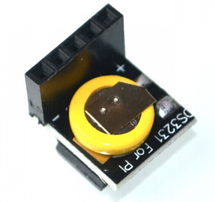

<!--- Copyright (c) 2017 Paweł Hajduk based on Peter Clark module. See the file LICENSE for copying permission. -->
DS3231 RTC
=========

<!--- * KEYWORDS: Module,RTC,Real Time Clock,Clock,Time,Date -->

**Note:** Espruino contains its own RTC, but it requires to solder in a 32kHz watch crystal. It's easy to solder watch crystal onto espruino board but it gets complicated with espruino pico. A good alternative is to buy cheap DS3231 RTC module, moreover it provides battery back-up, calendar functionality and up to 10 times better accuracy.

This document assumes that you are using one of cheap RTC modules for Raspberry PI. (should work as well with other DS3231 modules)




| Espruino | DS3231 module|
|----------|------------------------------|
| 3V3 | + |
| B7 (SDA) | D |
| B6 (SCL) | C |
| Not connected | NC |
| GND | - |

**Note:** DS3231 module has soldered pull up resistors. However if you get an error: `Uncaught InternalError: Timeout on I2C Write BUSY` it may be caused by too low pull up value, in this case it's necessary to solder 4.7k-10k resistor onto it.

**Note:** This module is designed to be compatible with the [JS date object](https://www.w3schools.com/jsref/jsref_obj_date.asp)

property | value
----| ----
miliseconds | 0-999
seconds | 0-59
minutes | 0-59
hours | 0-23
day of the month (date) | 1-31
month | 0-11
day of the week | 0-6
year | eg: 2017

Initialising
------------

Initialise the module by calling `require("DS3231").connect`, passing in an `I2C` interface.

pull a module right off github (not minified):

```Javascript
I2C1.setup({scl: B6,sda: B7});
var rtc = require("https://github.com/ancienthero/espruino/blob/master/modules/DS3231/DS3231.js").connect(I2C1);
```
or from local folder

```Javascript
I2C1.setup({scl: B6,sda: B7});
var rtc = require("DS3231").connect(I2C1);
```

Daylight saving
---------------

I belivie daylight saving should not be handled in this module.


Setting Date/Time/Dow
-----------------

To set the date:
```Javascript
rtc.setDate(date,month,year);
// 1st January 2017
rtc.setDate(1,0,2017);
```

To set the time:
```Javascript
rtc.setTime(hours,minutes);
// 22:59
rtc.setTime(22,59);
```

To set day of the week:
```Javascript
rtc.setDow(dow);
// Sunday (or Monday if it's 1st day of the week for you)
rtc.setDow(0);
```

Reading Date/Time/Dow
-----------------

To read Date/Time as a JS date object and print to the console:
```Javascript
var t = rtc.readDateTime();
console.log(t.toString());
```

Reading single property:
```Javascript
// can be "hours", "minutes", "dow", "date", "month", "year"
rtc.readDateTime("hours");
```

Example
-----------------

Reads from rtc module and prints to the console every second:

```Javascript
I2C1.setup({scl: B6,sda: B7});
var rtc = require("https://github.com/ancienthero/espruino/blob/master/modules/DS3231/DS3231.js").connect(I2C1);

setInterval(function() {
  console.log(rtc.readDateTime().toString());
}, 1000);
```
